# Домашнее задание к занятию 11 «Teamcity» - Илларионов Дмитрий

## Подготовка к выполнению

1. В Yandex Cloud создайте новый инстанс (4CPU4RAM) на основе образа `jetbrains/teamcity-server`.

Создал.


2. Дождитесь запуска teamcity, выполните первоначальную настройку.

Выполнил.


3. Создайте ещё один инстанс (2CPU4RAM) на основе образа `jetbrains/teamcity-agent`. Пропишите к нему переменную окружения `SERVER_URL: "http://<teamcity_url>:8111"`.

Агент создал рядом в отдельном контейнере на той же ВМ где и сам Teamcity. Для учебных целей считаю допустимо.

4. Авторизуйте агент.
авторизовал.

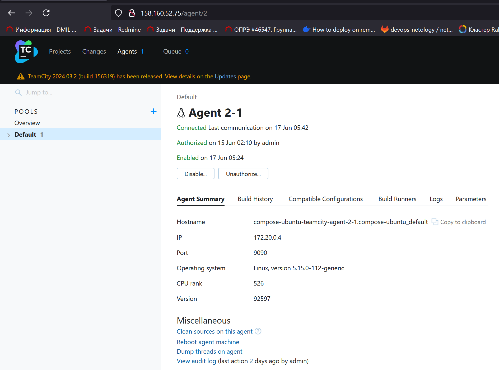

5. Сделайте fork [репозитория](https://github.com/aragastmatb/example-teamcity).

Скопировал все файлы в свой репозиторий и там уже с ними работаю.

6. Создайте VM (2CPU4RAM) и запустите [playbook](./infrastructure).

ВМ создал, при запуске плейбука:

```
root@ansible:~/teamcity/infrastructure# ansible-playbook -i inventory/cicd/hosts.yml site.yml
```
Получил ошибку:

```
TASK [Create Nexus group] *********************************************************************
fatal: [nexus]: FAILED! => {"msg": "The task includes an option with an undefined variable. The error was: 'nexus_user_group' is undefined. 'nexus_user_group' is undefined\n\nThe error appears to be in '/root/teamcity/infrastructure/site.yml': line 5, column 7, but may\nbe elsewhere in the file depending on the exact syntax problem.\n\nThe offending line appears to be:\n\n  pre_tasks:\n    - name: Create Nexus group\n      ^ here\n"}
```

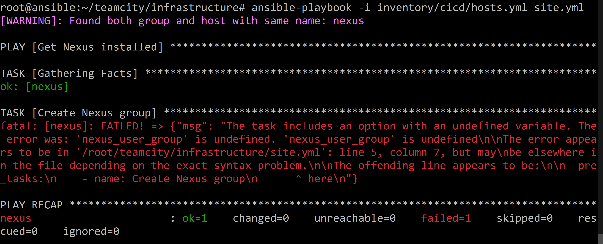

Скорректировал располжение файлов в ансибле.
Плейбук отработал.
Создался nexus.

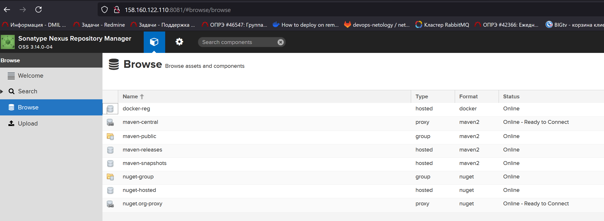


## Основная часть

1. Создайте новый проект в teamcity на основе fork.

Создал:

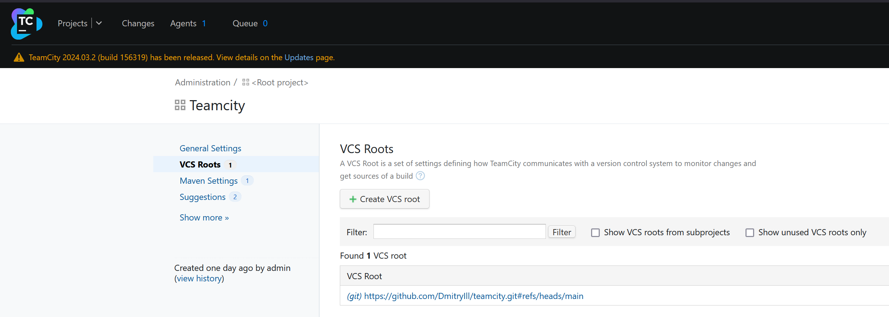

2. Сделайте autodetect конфигурации.
3. Сохраните необходимые шаги, запустите первую сборку master.

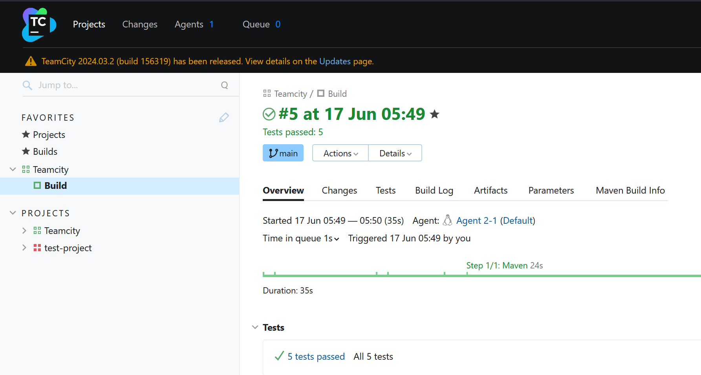

4. Поменяйте условия сборки: если сборка по ветке `master`, то должен происходит `mvn clean deploy`, иначе `mvn clean test`.

Создал два шага сборки. 

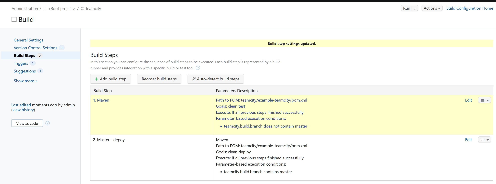

В первом указал что только не для мастер ветки и выпонять тест:

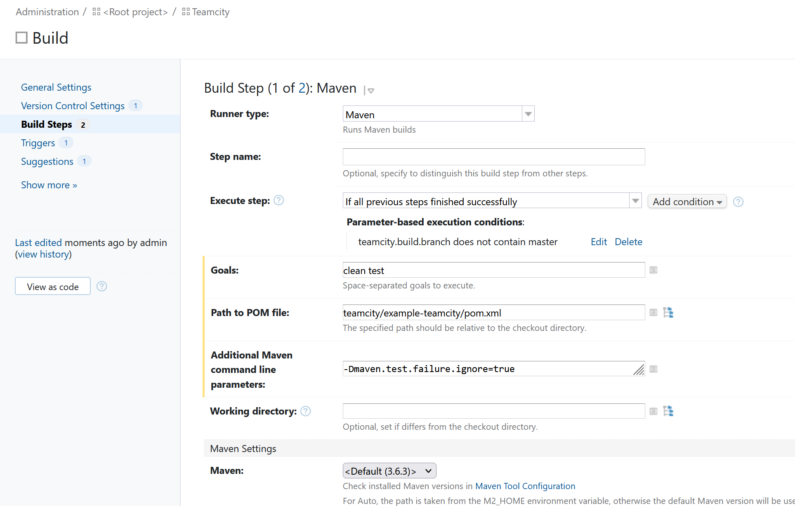

Во втором шаге указал - только для мастер ветки и выполнять деплой:

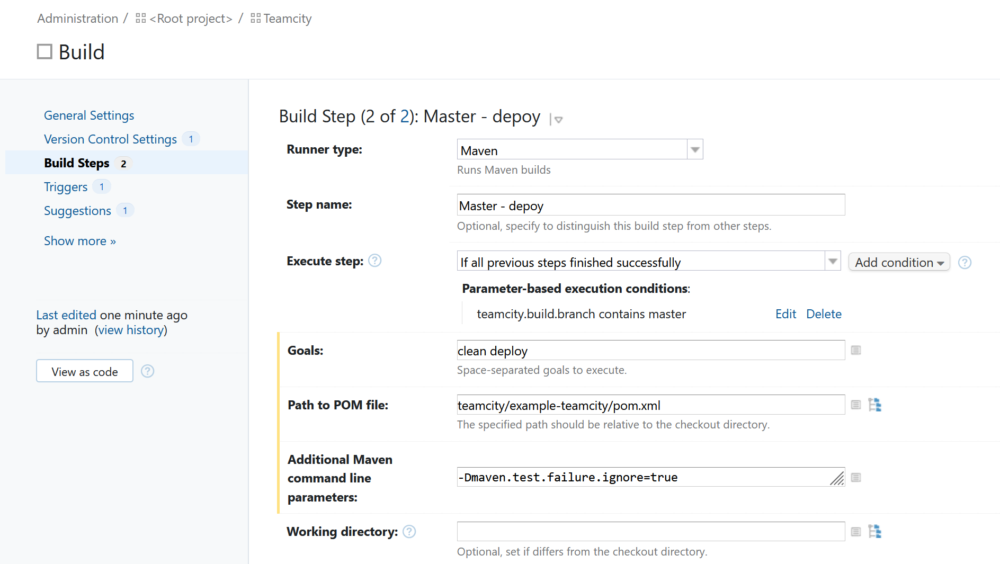

Но, у меня в репозитории нет ветки мастер а есть ветка main. Переделал на main:

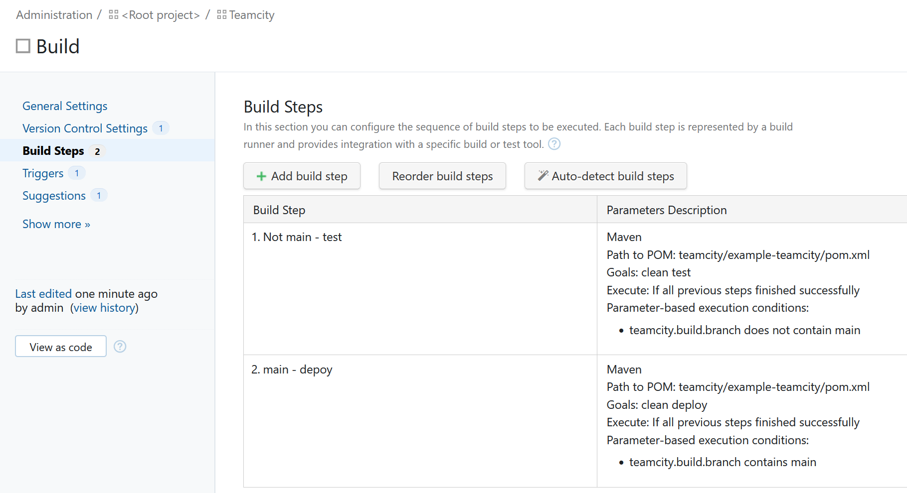


5. Для deploy будет необходимо загрузить [settings.xml](./teamcity/settings.xml) в набор конфигураций maven у teamcity, предварительно записав туда креды для подключения к nexus.

Там уже прописано корректно - у меня такие же логин и пасс.

6. В pom.xml необходимо поменять ссылки на репозиторий и nexus.

Поменял ссылку на репозиторий:

```
	<distributionManagement>
		<repository>
				<id>nexus</id>
				<url>http://158.160.122.110:8081/repository/maven-releases</url>
		</repository>
	</distributionManagement>
```

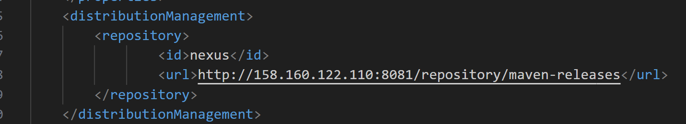

7. Запустите сборку по master, убедитесь, что всё прошло успешно и артефакт появился в nexus.

Пока запустил вручную, степ деплоя не прошел:

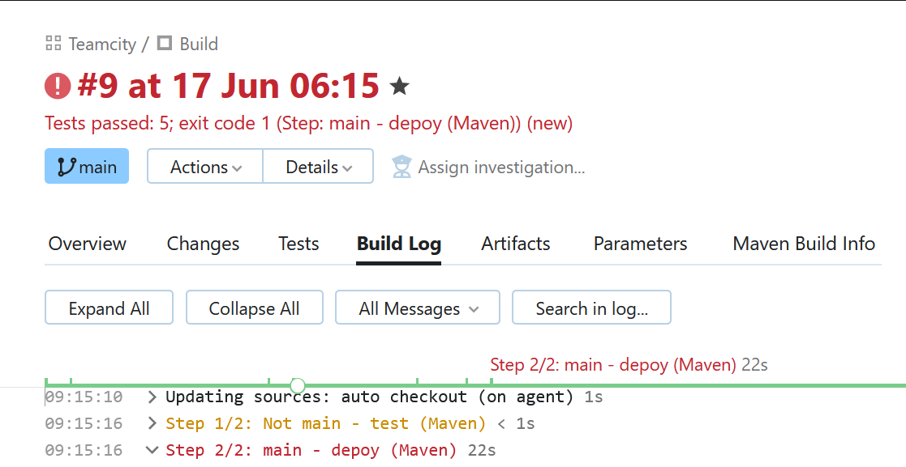

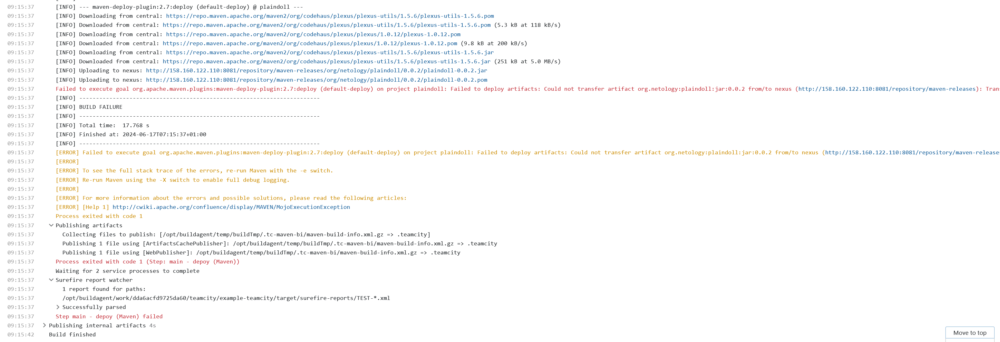

Ошибки:

```
Failed to execute goal org.apache.maven.plugins:maven-deploy-plugin:2.7:deploy (default-deploy) on project plaindoll: Failed to deploy artifacts: Could not transfer artifact org.netology:plaindoll:jar:0.0.2 from/to nexus (http://158.160.122.110:8081/repository/maven-releases): Transfer failed for http://158.160.122.110:8081/repository/maven-releases/org/netology/plaindoll/0.0.2/plaindoll-0.0.2.jar 400 Repository does not allow updating assets: maven-releases
09:15:37
  [INFO] ------------------------------------------------------------------------
09:15:37
  [INFO] BUILD FAILURE
09:15:37
  [INFO] ------------------------------------------------------------------------
09:15:37
  [INFO] Total time:  17.768 s
09:15:37
  [INFO] Finished at: 2024-06-17T07:15:37+01:00
09:15:37
  [INFO] ------------------------------------------------------------------------
09:15:37
  [ERROR] Failed to execute goal org.apache.maven.plugins:maven-deploy-plugin:2.7:deploy (default-deploy) on project plaindoll: Failed to deploy artifacts: Could not transfer artifact org.netology:plaindoll:jar:0.0.2 from/to nexus (http://158.160.122.110:8081/repository/maven-releases): Transfer failed for http://158.160.122.110:8081/repository/maven-releases/org/netology/plaindoll/0.0.2/plaindoll-0.0.2.jar 400 Repository does not allow updating assets: maven-releases -> [Help 1]
09:15:37
  [ERROR]
09:15:37
  [ERROR] To see the full stack trace of the errors, re-run Maven with the -e switch.
09:15:37
  [ERROR] Re-run Maven using the -X switch to enable full debug logging.
09:15:37
  [ERROR]
09:15:37
  [ERROR] For more information about the errors and possible solutions, please read the following articles:
09:15:37
  [ERROR] [Help 1] http://cwiki.apache.org/confluence/display/MAVEN/MojoExecutionException
09:15:37
  Process exited with code 1
```

Причина была в том, что ранее я уже делал деплой, и уже есть такая версия в nexus.
поэтому изменил в pom файле версию на 0.0.3 и еще раз запустил вручную:

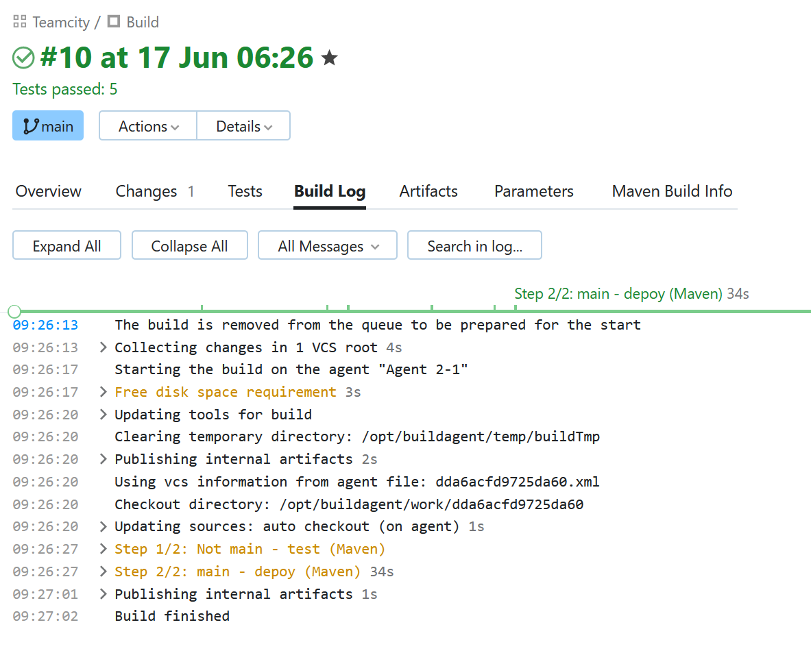

Все прошло, ок, в nexus есть результаты:

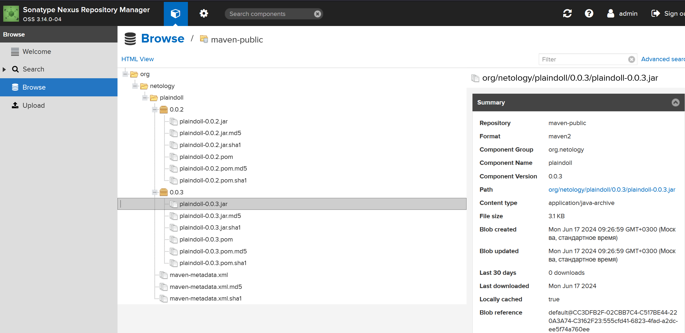


8. Мигрируйте `build configuration` в репозиторий.

Не очень понял что тут и как нужно сделать?
Видимо нуно конфигурацию билда сохранить как код в репозиторий.
Получилась такая конфигурация:

```
package _Self.buildTypes

import jetbrains.buildServer.configs.kotlin.v2019_2.*
import jetbrains.buildServer.configs.kotlin.v2019_2.buildSteps.maven
import jetbrains.buildServer.configs.kotlin.v2019_2.triggers.vcs

object Build : BuildType({
    name = "Build"

    vcs {
        root(HttpsGithubComDmitryIllTeamcityGitRefsHeadsMain)
    }
    steps {
        maven {
            name = "Not main - test"

            conditions {
                doesNotContain("teamcity.build.branch", "main")
            }
            goals = "clean test"
            pomLocation = "teamcity/example-teamcity/pom.xml"
            runnerArgs = "-Dmaven.test.failure.ignore=true"
            userSettingsSelection = "settings.xml"
        }
        maven {
            name = "main - depoy"

            conditions {
                contains("teamcity.build.branch", "main")
            }
            goals = "clean deploy"
            pomLocation = "teamcity/example-teamcity/pom.xml"
            runnerArgs = "-Dmaven.test.failure.ignore=true"
            userSettingsSelection = "settings.xml"
        }
    }
    triggers {
        vcs {
        }
    }
})

```
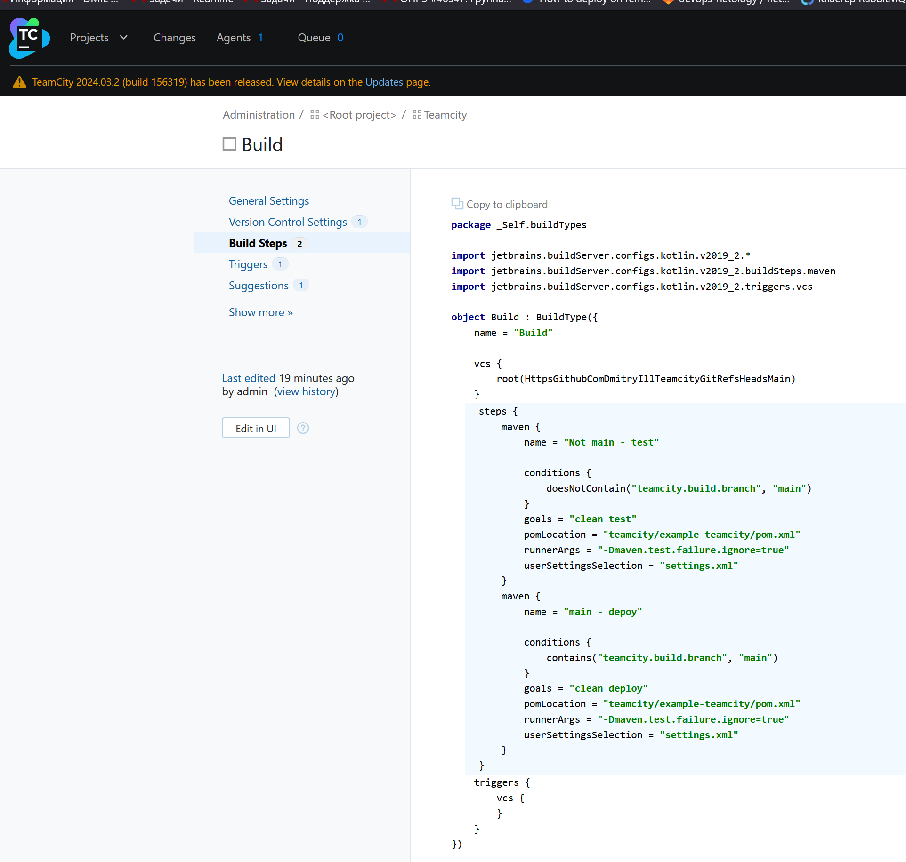

9. Создайте отдельную ветку `feature/add_reply` в репозитории.

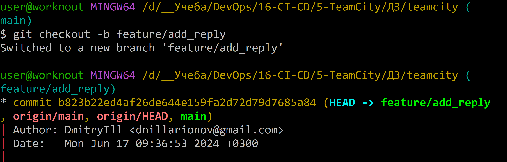

10. Напишите новый метод для класса Welcomer: метод должен возвращать произвольную реплику, содержащую слово `hunter`.

Добавил строчки:

```
	public String sayHunter() {
		return "Good hunter!";
	}	
```
в

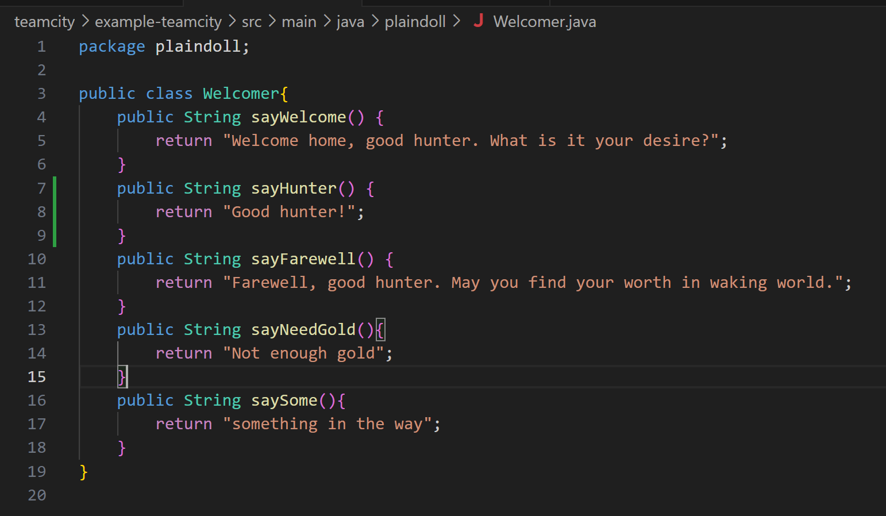


11. Дополните тест для нового метода на поиск слова `hunter` в новой реплике.

Добавил тест:

```

	@Test
	public void welcomerSaysHunter() {
		assertThat(welcomer.sayHunter(), containsString("hunter"));
	}
```
в

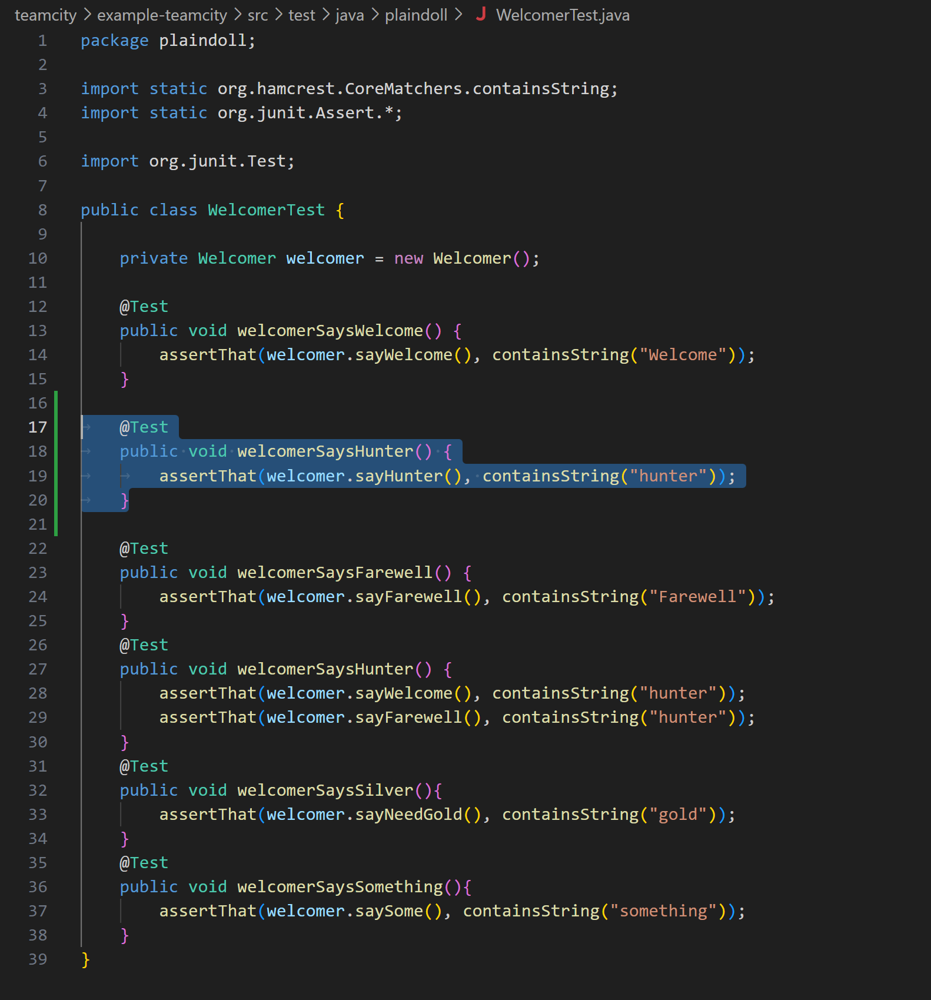


12. Сделайте push всех изменений в новую ветку репозитория.

Сделал

13. Убедитесь, что сборка самостоятельно запустилась, тесты прошли успешно.

Закончилась ошибкой:

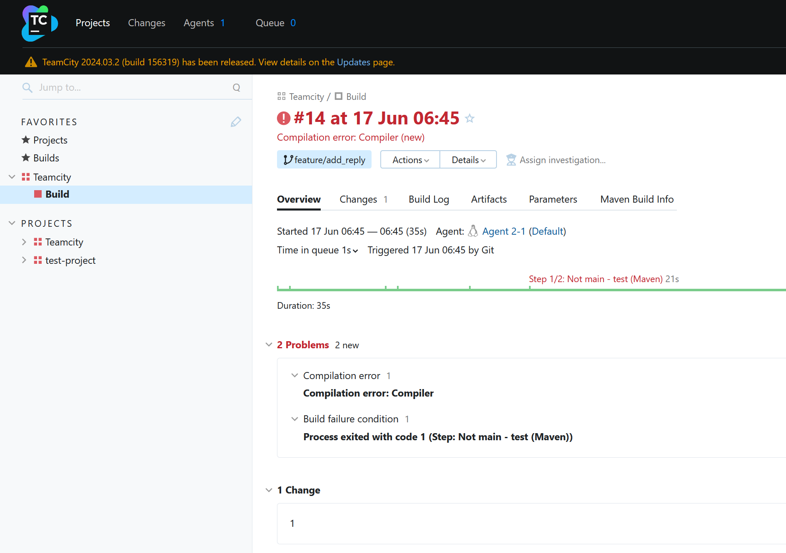

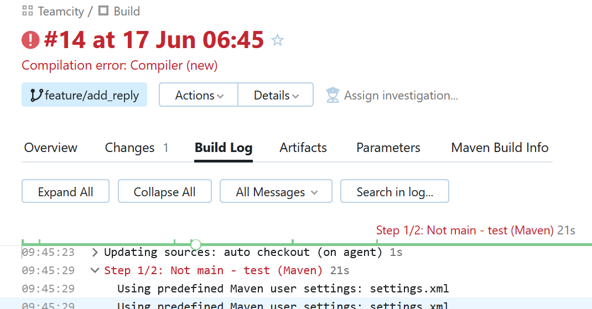

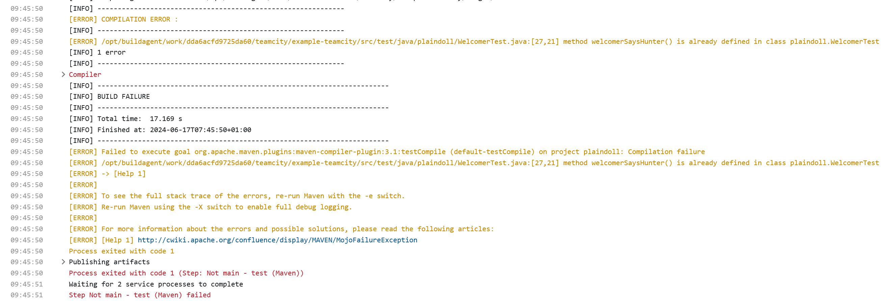

```
[ERROR] Failed to execute goal org.apache.maven.plugins:maven-compiler-plugin:3.1:testCompile (default-testCompile) on project plaindoll: Compilation failure
09:45:50
  [ERROR] /opt/buildagent/work/dda6acfd9725da60/teamcity/example-teamcity/src/test/java/plaindoll/WelcomerTest.java:[27,21] method welcomerSaysHunter() is already defined in class plaindoll.WelcomerTest
09:45:50
  [ERROR] -> [Help 1]
09:45:50
  [ERROR]
09:45:50
  [ERROR] To see the full stack trace of the errors, re-run Maven with the -e switch.
09:45:50
  [ERROR] Re-run Maven using the -X switch to enable full debug logging.
09:45:50
  [ERROR]
09:45:50
  [ERROR] For more information about the errors and possible solutions, please read the following articles:
09:45:50
  [ERROR] [Help 1] http://cwiki.apache.org/confluence/display/MAVEN/MojoFailureException
09:45:50
  Process exited with code 1
```

Тогда исправил на :

```
	@Test
	public void welcomerSaysHunter2() {
		assertThat(welcomer.sayHunter(), containsString("hunter"));
	}
```
Тесты прошли:

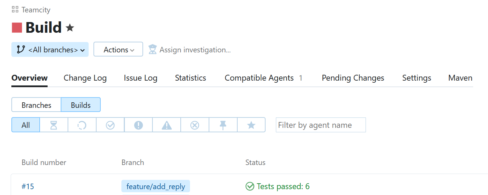

14. Внесите изменения из произвольной ветки `feature/add_reply` в `master` через `Merge`.

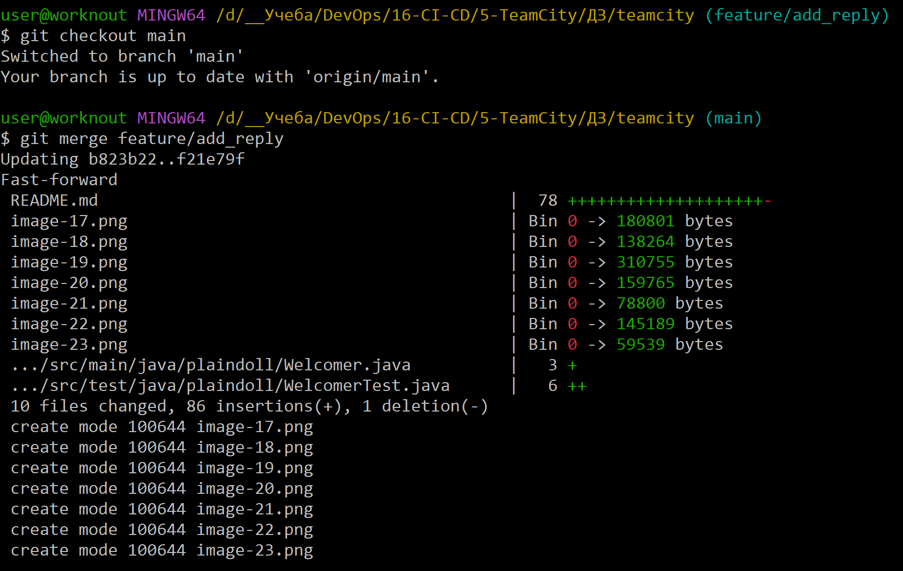

Я забыл поменять номер версии в POM поэтому еще раз меняю номер версии в ветке разработки:
поставил версию:

```
	<packaging>jar</packaging>
	<version>0.1.0</version>
```

Еще раз делаю пуш:


15. Убедитесь, что нет собранного артефакта в сборке по ветке `master`.


16. Настройте конфигурацию так, чтобы она собирала `.jar` в артефакты сборки.
17. Проведите повторную сборку мастера, убедитесь, что сбора прошла успешно и артефакты собраны.
18. Проверьте, что конфигурация в репозитории содержит все настройки конфигурации из teamcity.
19. В ответе пришлите ссылку на репозиторий.

---

### Как оформить решение задания

Выполненное домашнее задание пришлите в виде ссылки на .md-файл в вашем репозитории.

---
