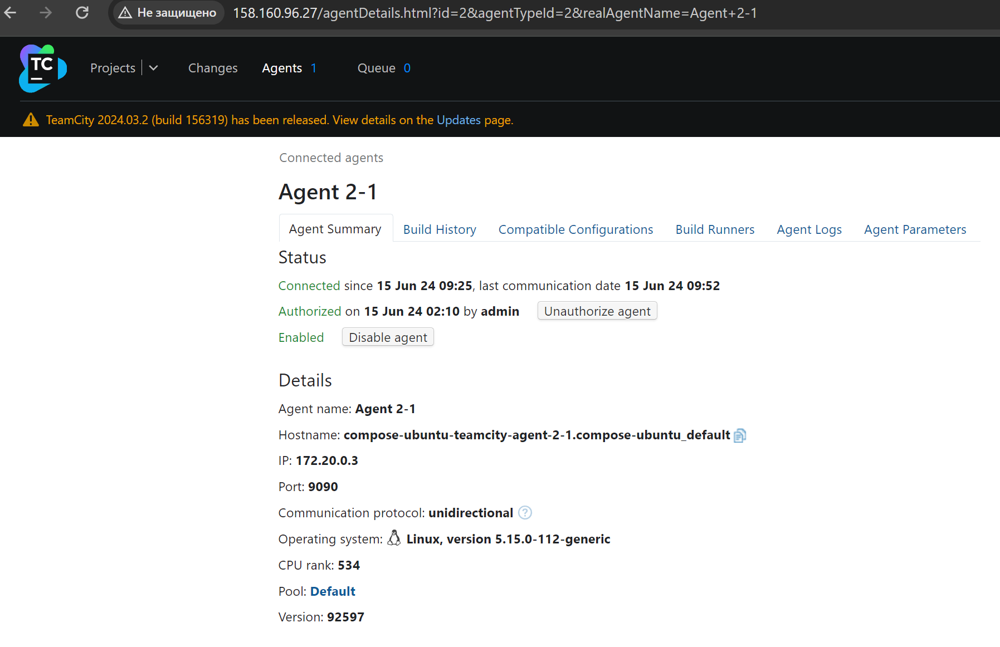

# Домашнее задание к занятию 11 «Teamcity» - Илларионов Дмитрий

## Подготовка к выполнению

1. В Yandex Cloud создайте новый инстанс (4CPU4RAM) на основе образа `jetbrains/teamcity-server`.


2. Дождитесь запуска teamcity, выполните первоначальную настройку.
3. Создайте ещё один инстанс (2CPU4RAM) на основе образа `jetbrains/teamcity-agent`. Пропишите к нему переменную окружения `SERVER_URL: "http://<teamcity_url>:8111"`.

Агент создал рядом в отдельном контейнере на той же ВМ где и сам Teamcity. Для учебных целей - считаю допустимо.

4. Авторизуйте агент.
авторизовал.



5. Сделайте fork [репозитория](https://github.com/aragastmatb/example-teamcity).

Скопировал все файлы в свой репозиторий и там уже с ними работаю.

6. Создайте VM (2CPU4RAM) и запустите [playbook](./infrastructure).

ВМ создал, при запуске плейбука:

```
root@ansible:~/teamcity/infrastructure# ansible-playbook -i inventory/cicd/hosts.yml site.yml
```
получаю ошибку:

```
TASK [Create Nexus group] *********************************************************************
fatal: [nexus]: FAILED! => {"msg": "The task includes an option with an undefined variable. The error was: 'nexus_user_group' is undefined. 'nexus_user_group' is undefined\n\nThe error appears to be in '/root/teamcity/infrastructure/site.yml': line 5, column 7, but may\nbe elsewhere in the file depending on the exact syntax problem.\n\nThe offending line appears to be:\n\n  pre_tasks:\n    - name: Create Nexus group\n      ^ here\n"}
```


Не понял в чем проблема? Ведь есть файл с определенными переменными. Что не так?
сами файлы см. в репозитории.

Ансибл - использую на отдельной ВМ в облаке.


## Основная часть

1. Создайте новый проект в teamcity на основе fork.
2. Сделайте autodetect конфигурации.
3. Сохраните необходимые шаги, запустите первую сборку master.
4. Поменяйте условия сборки: если сборка по ветке `master`, то должен происходит `mvn clean deploy`, иначе `mvn clean test`.
5. Для deploy будет необходимо загрузить [settings.xml](./teamcity/settings.xml) в набор конфигураций maven у teamcity, предварительно записав туда креды для подключения к nexus.
6. В pom.xml необходимо поменять ссылки на репозиторий и nexus.
7. Запустите сборку по master, убедитесь, что всё прошло успешно и артефакт появился в nexus.
8. Мигрируйте `build configuration` в репозиторий.
9. Создайте отдельную ветку `feature/add_reply` в репозитории.
10. Напишите новый метод для класса Welcomer: метод должен возвращать произвольную реплику, содержащую слово `hunter`.
11. Дополните тест для нового метода на поиск слова `hunter` в новой реплике.
12. Сделайте push всех изменений в новую ветку репозитория.
13. Убедитесь, что сборка самостоятельно запустилась, тесты прошли успешно.
14. Внесите изменения из произвольной ветки `feature/add_reply` в `master` через `Merge`.
15. Убедитесь, что нет собранного артефакта в сборке по ветке `master`.
16. Настройте конфигурацию так, чтобы она собирала `.jar` в артефакты сборки.
17. Проведите повторную сборку мастера, убедитесь, что сбора прошла успешно и артефакты собраны.
18. Проверьте, что конфигурация в репозитории содержит все настройки конфигурации из teamcity.
19. В ответе пришлите ссылку на репозиторий.

---

### Как оформить решение задания

Выполненное домашнее задание пришлите в виде ссылки на .md-файл в вашем репозитории.

---
